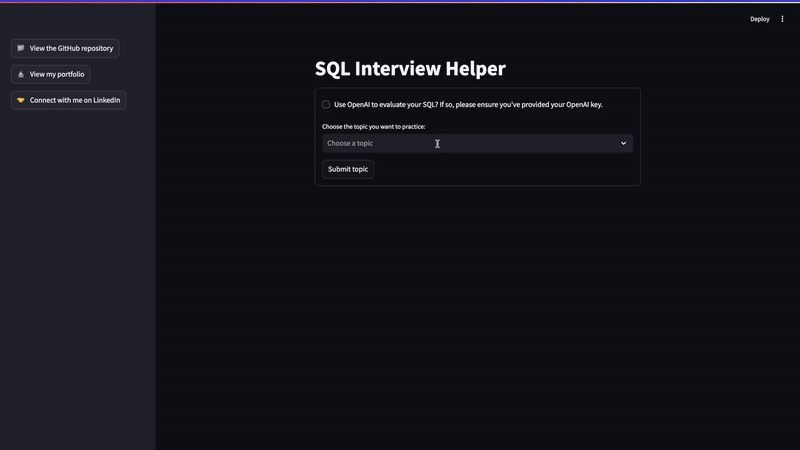

# SQL Interview Helper App

[![Try it in Streamlit][share_badge]][share_link] 



This is the version of my SQL Interview Helper App that removes the OpenAI API usage so it can be published in the Streamlit Community Cloud. Find the link above or [here](share_link)

Please see the original version of this app with the OpenAI API usage included [here](https://github.com/jacquelinekclee/sql-interview-helper/tree/main). 

See below for instructions to run this locally.  

# Set Up
First clone this repository. You'll also need to have `python3` installed on your local machine. 

## Set Up Your Virtual Environment
Once you're in the directory of this repository, run the following commands in your terminal:

```sh
python3 -m venv env
source env/bin/activate
```

### Install Necessary Packages
Run the commands below to install the necessary packages. If at any point you get a ` No module named '<package name>'` error, run `env/bin/python -m pip install <package name>`. 

```sh
env/bin/python -m pip install streamlit

env/bin/python -m pip install bs4

env/bin/python -m pip install dotenv

env/bin/python -m pip install streamlit_code_editor
```

# Run the SQL Interview Helper
Once set up, use the command below to run the SQL Interview Helper:

```sh
env/bin/python -m streamlit run app.py
```

# Sources
SQL exercises are sourced from [w3resource](https://www.w3resource.com/index.php). 

[share_badge]: https://static.streamlit.io/badges/streamlit_badge_black_white.svg
[share_link]: https://share.streamlit.io