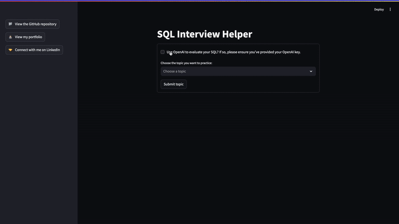

# SQL Interview Helper App

Back in Fall 2022 at UC San Diego, my classmates and I built a Data Science Interview helper leveraging GPT 3.5 for the final project of the course Deep Learning for Natural Language Understanding. This was right around the time ChatGPT first released, and we couldn't have predicted what was to come. You can see the final paper we submitted [here](./lign_167_final_paper.pdf) for all the details.

My portion was the SQL practice portion. I've taken that code and revamped it to use GPT-5 nano, and I also built a simple user interface leveraging Streamlit for users to more easily interact with the tool (an improvement from the Jupyter notebook I had submitted in 2022). Please see below for instructions on how to use my SQL Interview Helper. I hope this tool helps you hone your SQL skills and prepare for any interviews!

# Set Up
First clone this repository. You'll also need to have `python3` installed on your local machine. 

## [Optional] Add Your OpenAI API Key
If you want to leverage OpenAI to provide feedback for your SQL queries, locate the folder in your file manager and create a file called `.env`. Ensure this file name is exactly `.env`. In this file, add your OpenAI API key following this format: 

`API_KEY=<YOUR OPENAI API KEY HERE>`. 

An OpenAI key is not necessary to use this helper. Instead of custom feedback for your SQL queries, you'll simply see an example solution with detailed comments. 

## Set Up Your Virtual Environment
Once you're in the directory of this repository, run the following commands in your terminal:

`python3 -m venv env`
`source env/bin/activate`

### Install Necessary Packages
Run the commands below to install the necessary packages. If at any point you get a `No module named '<package name>'` error, run `env/bin/python -m pip install <package name>`. 

`env/bin/python -m pip install streamlit`

`env/bin/python -m pip install openai`

`env/bin/python -m pip install bs4`

`env/bin/python -m pip install dotenv`

`env/bin/python -m pip install streamlit_code_editor`

# Run the SQL Interview Helper
Once set up, use the command below to run the SQL Interview Helper:

`env/bin/python -m streamlit run app.py`

# Example Usage 

# Sources
SQL exercises are sourced from [w3resource](https://www.w3resource.com/index.php). 